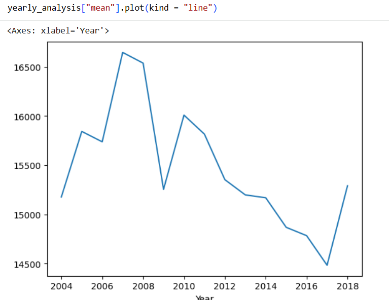
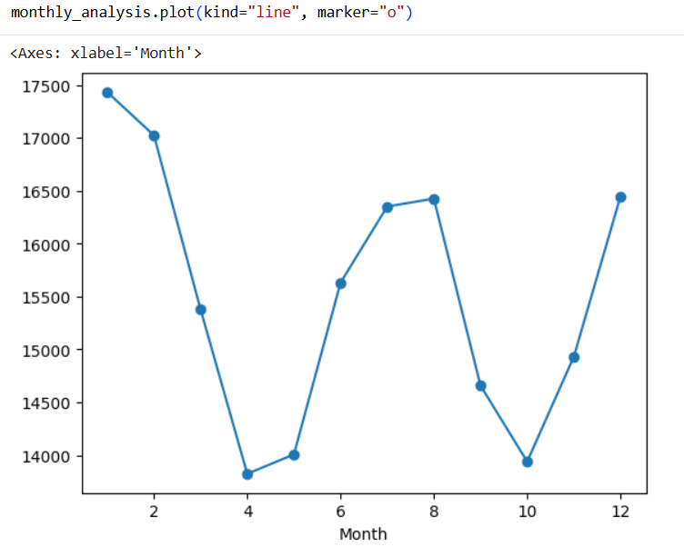
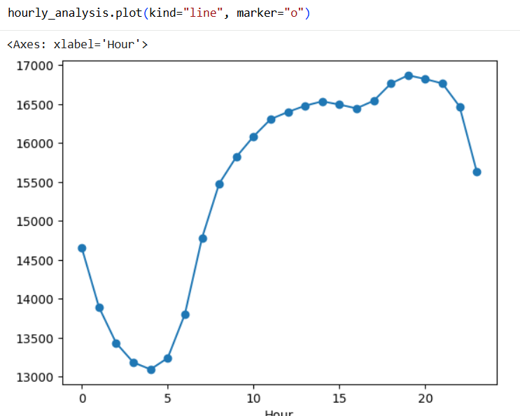
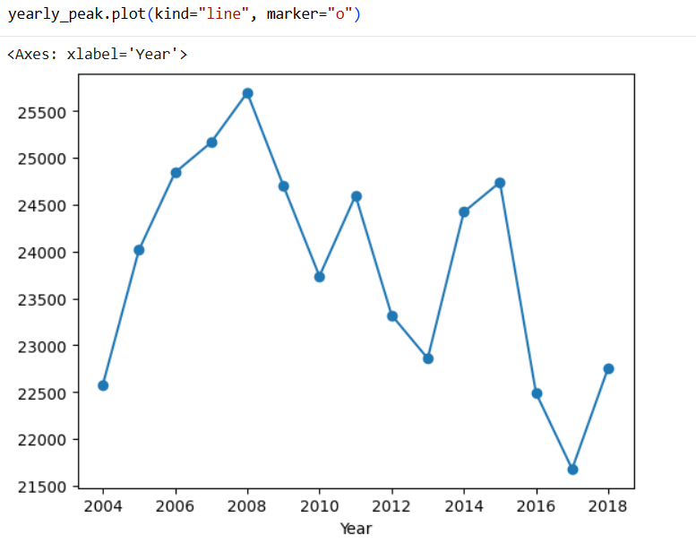
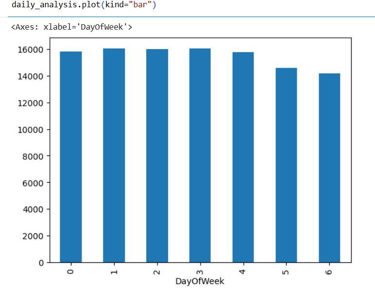
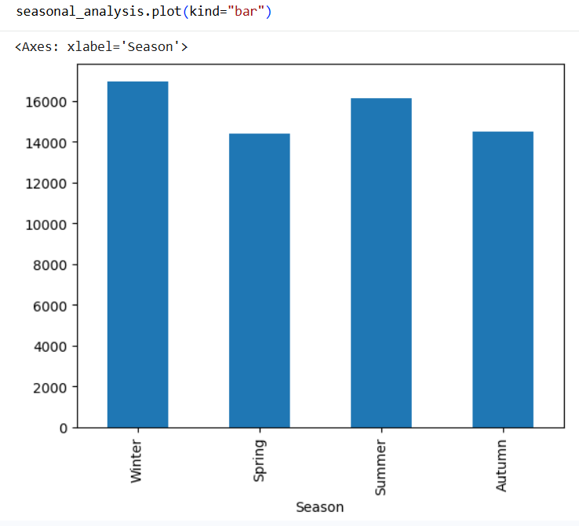
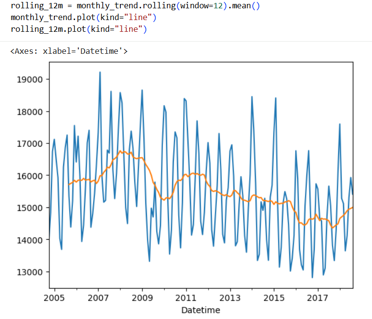
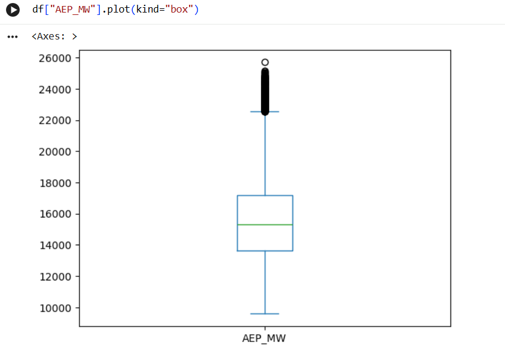

# Electricity Consumption Data Analysis

## Project Overview

This project analyzes historical hourly electricity consumption data using Python and Pandas.

The main objective is to explore electricity demand patterns across time and identify trends, seasonality, weekday/weekend differences, peak-demand periods, and statistically unusual observations.

## Objectives

The project aims to:

- Explore historical electricity consumption patterns.
- Analyze changes in electricity demand over time.
- Identify seasonal and daily demand patterns.
- Examine peak-demand periods and yearly peak values.
- Compare weekday and weekend consumption.
- Analyze the distribution of electricity consumption and identify statistical outliers.
- Develop practical experience with Python-based exploratory data analysis.

## Dataset

This project uses the `AEP_hourly.csv` dataset containing hourly electricity consumption data.

### Dataset Information

- **Dataset:** Hourly Energy Consumption
- **Series:** AEP
- **File:** `AEP_hourly.csv`
- **Frequency:** Hourly
- **Unit:** Megawatts (MW)
- **Time Period:** 2004–2018
- **Main Columns:**
  - `Datetime`: Timestamp of the observation.
  - `AEP_MW`: Electricity consumption in megawatts (MW).

### Data Sources

- **Dataset Source:** [Kaggle – Hourly Energy Consumption](https://www.kaggle.com/datasets/robikscube/hourly-energy-consumption)
- **Original Data Source:** PJM Interconnection

The dataset was used as the basis for this project. All data preparation, exploratory analysis, transformations, visualizations, and interpretations presented in this project were independently performed as part of this analysis.

## Technologies & Libraries

The project was developed using the following technologies and libraries:

- **Python** – Programming language used for data analysis.
- **Pandas** – Data manipulation, transformation, aggregation, and time-series analysis.
- **NumPy** – Numerical operations and data processing.
- **Matplotlib** – Data visualization and charting.
- **Seaborn** – Statistical data visualization.
- **Google Colab** – Cloud-based development environment used to develop and run the analysis.
- **Jupyter Notebook** – Notebook format used to organize the analysis, code, visualizations, and findings.

## Analysis

The analysis focuses on understanding electricity consumption patterns from different temporal and statistical perspectives.

### 1. Data Preparation

- Loaded and inspected the dataset using Pandas.
- Converted the `Datetime` column into Pandas datetime format.
- Extracted time-based features including year, month, hour, and day of week.
- Created additional categorical features for weekday/weekend and seasonal analysis.

### 2. Yearly Analysis

- Calculated yearly electricity consumption averages.
- Examined changes in average demand over the years.
- Compared the number of observations across years to identify incomplete periods.
- Calculated yearly peak demand values.

### 3. Monthly & Seasonal Analysis

- Calculated average electricity consumption by month.
- Identified recurring seasonal patterns in electricity demand.
- Grouped observations into Winter, Spring, Summer, and Autumn.
- Compared average consumption levels across seasons.

### 4. Hourly Analysis

- Calculated average electricity consumption for each hour of the day.
- Examined the daily demand profile and recurring hourly patterns.

### 5. Weekday & Weekend Analysis

- Compared average electricity consumption across individual days of the week.
- Grouped observations into weekdays and weekends.
- Calculated the difference between average weekday and weekend demand.

### 6. Peak Demand Analysis

- Identified the highest electricity consumption observations in the dataset.
- Examined the top peak-demand periods.
- Compared yearly peak demand values.
- Compared average demand with peak demand to highlight the difference between typical consumption and system-demand extremes.

### 7. Time-Series Analysis

- Resampled the hourly data into monthly periods to analyze chronological trends.
- Applied a 12-month rolling average to smooth short-term fluctuations and highlight longer-term patterns.

### 8. Distribution & Outlier Analysis

- Examined the distribution of electricity consumption using histograms and boxplots.
- Calculated quartiles and the Interquartile Range (IQR).
- Identified statistically unusual observations using the IQR method.
- Evaluated outliers in the context of electricity demand rather than automatically treating them as erroneous data.

## Key Findings

The analysis revealed several important patterns in electricity consumption:

- **Strong seasonality:** Electricity consumption varied significantly across months and seasons. Average demand was highest during the winter months, particularly January and February, while lower consumption levels were generally observed during spring and autumn.

- **Distinct daily demand patterns:** Average electricity consumption varied considerably throughout the day, demonstrating a clear hourly demand profile.

- **Weekday vs. weekend difference:** Electricity consumption was consistently higher on weekdays than on weekends. Sunday had the lowest average consumption among the days of the week, while Tuesday had the highest.

- **Significant peak-demand events:** The highest recorded electricity consumption in the dataset was **25,695 MW on October 20, 2008 at 14:00**.

- **Concentration of peak events:** 9 of the 10 highest consumption observations occurred in 2007. Several of these high-demand observations occurred during August 8–9, 2007, indicating periods of sustained high demand rather than isolated peaks.

- **Average demand vs. peak demand:** Yearly average consumption and yearly peak demand did not always follow the same pattern. This highlights the importance of analyzing both typical demand levels and extreme demand events when evaluating electricity consumption.

- **Long-term changes:** Average annual consumption generally increased between 2004 and 2008, followed by a decline in 2009. From 2010 to 2017, average demand showed an overall downward tendency with year-to-year fluctuations.

- **Incomplete periods:** The dataset contains partial years at the beginning and end of the observed period. Therefore, comparisons involving 2004 and especially 2018 should be interpreted with caution.

- **Statistical outliers:** The IQR method identified unusually high or low observations. These observations were not automatically considered data errors because extreme electricity demand can represent genuine events with potential operational significance.

## Visualizations

The following visualizations summarize the main findings of the analysis, including long-term trends, seasonality, daily demand patterns, peak demand, time-series behavior, and consumption distribution.

| Yearly Analysis | Monthly Analysis |
|---|---|
|  |  |

| Hourly Analysis | Yearly Peak |
|---|---|
|  |  |

| Daily Analysis | Seasonal Analysis |
|---|---|
|  |  |

| Rolling 12M with Monthly Trend | Frequency Distribution |
|---|---|
|  |  |

| Distribution & Outliers | |
|---|---|
|  | |

## Project Structure

```text
electricity-consumption-data-analysis/
│
├── images/
│   ├── yearly-analysis.png
│   ├── monthly-analysis.png
│   ├── hourly-analysis.png
│   ├── yearly-peak.png
│   ├── daily-analysis.png
│   ├── seasonal-analysis.png
│   ├── rolling-12m-with-monthly-trend.png
│   ├── frequency-distribution.png
│   └── distribution-and-outliers.png
│
├── Electricity_Consumption_Data_Analysis.ipynb
└── README.md
